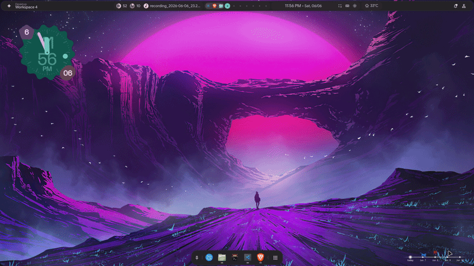
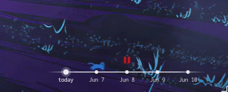
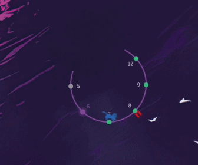
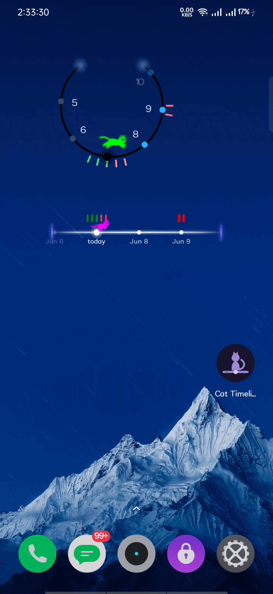

<div align="center">

# 🐈 cat-timeline

**A living to-do widget for your Linux desktop.**

A cat runs along a glowing timeline that flows with the clock — your tasks ride above each day, and *today* is wherever the cat is standing.



<br><br>

<!-- two shapes, side by side -->
<table>
  <tr>
    <td align="center"><b>Bar</b></td>
    <td align="center"><b>Ring</b></td>
  </tr>
  <tr>
    <td align="center" valign="middle"></td>
    <td align="center" valign="middle"></td>
  </tr>
</table>

</div>

---
<!-- 
## 🎬 Demo

A quick walkthrough of the widget and its settings:

<div align="center">

<video src="https://github.com/Andrew-Velox/cat-timeline/raw/main/docs/cat-timeline.mp4" controls width="640"></video>

</div>

> If the player doesn't load, **[watch / download the demo here](https://github.com/Andrew-Velox/cat-timeline/blob/main/docs/cat-timeline.mp4)**. -->

---

## ✨ Highlights

- **Two shapes** — a sleek horizontal **bar** or a clock-like **ring**. Switch anytime.
- **A cat that knows the time** — the [RunCat](https://github.com/Kyome22/RunCat365) runner marks *now*; each day drifts toward it and arrives exactly at midnight.
- **Tasks at a glance** — colored dashes per day; complete one and it quietly disappears from the widget.
- **Lives on your desktop** — a transparent `gtk-layer-shell` surface that sits behind your windows, takes clicks, and **drags anywhere** (position remembered).
- **Make it yours** — a polished dark settings panel: a Home view (Unfinished / Done), a custom calendar, and live color pickers for every element.
- **Featherweight** — pure C with GTK3 + Cairo. One drawing area, one timer, no threads; only the widget's rectangle repaints, only when something changes.

---

## 📱 Mobile — coming soon

The same running cat is heading to your phone — your timeline and tasks, right on the home screen.

<div align="center">

</div>

---

## 🚀 Quick start

**Arch**
```sh
sudo pacman -S gtk3 gtk-layer-shell meson ninja gcc
```
<details><summary>Debian / Ubuntu · Fedora</summary>

```sh
# Debian / Ubuntu
sudo apt install libgtk-3-dev libgtk-layer-shell-dev meson ninja-build gcc
# Fedora
sudo dnf install gtk3-devel gtk-layer-shell-devel meson ninja-build gcc
```
</details>

**Build & run**
```sh
git clone https://github.com/Andrew-Velox/cat-timeline.git
cd cat-timeline
meson setup build && ninja -C build
./build/cat-timeline
```

Install system-wide with `sudo ninja -C build install`.
> `gtk-layer-shell` is optional but recommended; without it the widget falls back to a borderless always-on-top window. `cJSON` is bundled.

---

## 🎮 Use it

| Action | What happens |
|---|---|
| **Click** a day dot | Open that day's task panel |
| **Double-click** empty space | Open the settings window |
| **Drag** | Move the widget (remembered across restarts) |
| **Right-click** | Quit |

Autostart on Hyprland — add to your config:
```ini
exec-once = cat-timeline
```

> Tip: set `CAT_TIMELINE_DEMO=20` to compress a day into 20 seconds and watch the timeline scroll.

Everything is saved under `~/.local/share/cat-timeline/` (`tasks.json`, `settings.json`, `position`).

---

## 🙏 Credits & License

Cat sprites by **Takuto Nakamura ([RunCat](https://github.com/Kyome22/RunCat365))**, Apache-2.0 — embedded unmodified, recolored at render time ([license](assets/runcat/LICENSE)). JSON via bundled **cJSON** (MIT). The rest of the project is provided as-is.
