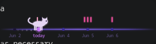

# cat-timeline

A lightweight desktop todo widget for Linux. A glowing purple timeline runs
across a small borderless window: one dot per day, a Cairo-drawn cat running in
place on **today**, and little dashes above each dot for the tasks due that day.
Hover a dot for a tooltip, click it to manage that day's tasks.

Everything is drawn with **Cairo paths** — there are no image assets. The cat,
the line glow, the dots, the task dashes and the hover tooltip are all rendered
into a single `GtkDrawingArea`.



---

## Features

- Borderless, always-on-top, no taskbar entry, compact **320 × 90** window with a
  fully transparent background (only the cat and timeline are drawn).
- Spawns in the bottom-right corner of the primary monitor.
- Horizontal timeline with a soft purple glow that fades out toward the edges.
- A handful of day dots (1 past, today, 3 future), today's dot at 25% from the left.
- An 8-frame Cairo cat animation (legs, body bob, tail) on today's dot, with a
  fading paw-print trail.
- Per-day task dashes above each dot (max 8, then a `+N` overflow badge), colour
  coded by state (pending / today / past / done).
- Hover tooltip drawn on the canvas (date, `+Nd` offset, task list, hint).
- Click a dot to open a `GtkPopover` for adding, toggling and deleting tasks.
- Right-click anywhere for a **Quit** menu; click-and-drag empty space to move
  the window.
- Tasks stored as JSON in `~/.local/share/cat-timeline/tasks.json`, saved on
  every change.

---

## Dependencies

| Package | Purpose            |
|---------|--------------------|
| `gtk3`  | windowing / widgets |
| `cairo` | 2D drawing (pulled in by gtk3) |
| `meson` | build system       |
| `ninja` | build backend      |
| a C99 compiler (`gcc` or `clang`) | |

`cJSON` is bundled in `assets/` and compiled into the binary — no extra package
needed.

### Install on Arch

```sh
sudo pacman -S gtk3 meson ninja gcc
```

### Debian / Ubuntu

```sh
sudo apt install libgtk-3-dev meson ninja-build gcc
```

### Fedora

```sh
sudo dnf install gtk3-devel meson ninja-build gcc
```

---

## Build

```sh
meson setup build
cd build
ninja
```

The resulting binary is `build/cat-timeline`. Run it directly:

```sh
./build/cat-timeline
```

Optionally install it system-wide (`/usr/local/bin/cat-timeline` by default):

```sh
sudo ninja -C build install
```

---

## Autostart on Hyprland

Add the binary to your Hyprland config (`~/.config/hypr/hyprland.conf`).
Because Wayland compositors place windows themselves, use a window rule to pin
it to the bottom-right and keep it floating / pinned rather than relying on the
app's own positioning:

```ini
# Launch the widget at startup (use an absolute path or install it on $PATH)
exec-once = cat-timeline

# Keep it floating, pinned, and out of the layout
windowrulev2 = float,        class:^(cat-timeline)$
windowrulev2 = pin,          class:^(cat-timeline)$
windowrulev2 = nofocus,      class:^(cat-timeline)$
windowrulev2 = noborder,     class:^(cat-timeline)$
windowrulev2 = size 320 90,  class:^(cat-timeline)$
windowrulev2 = move 100%-344 100%-114, class:^(cat-timeline)$
```

`move 100%-344 100%-114` anchors it 24px from the bottom-right corner
(320 + 24 = 344, 90 + 24 = 114). Reload with `hyprctl reload`.

> For a true see-through widget you also need a compositor doing alpha blending.
> Hyprland does this out of the box; on other setups make sure a compositor
> (e.g. `picom` on X11) is running, or the transparent areas may render black.

On X11 desktops the app positions itself in the bottom-right corner on launch,
so no extra configuration is needed there.

---

## Data format

`~/.local/share/cat-timeline/tasks.json` (created on first save):

```json
{
  "2026-06-03": [
    { "id": "6a201b8e001", "text": "Fix bug",   "done": false },
    { "id": "6a201b8e002", "text": "Write docs", "done": true }
  ]
}
```

The whole file is loaded into memory on startup and rewritten on every change.

---

## Project layout

```
cat-timeline/
├── meson.build
├── README.md
├── src/
│   ├── main.c        entry point, GTK init
│   ├── app.h         shared state + geometry constants
│   ├── window.c/h    borderless always-on-top window, draw callback
│   ├── timeline.c/h  line, dots, date labels, task dashes
│   ├── cat.c/h       Cairo cat animation
│   ├── tasks.c/h     JSON load/save, task model, date helpers
│   ├── tooltip.c/h   hover popup rendered on the canvas
│   └── input.c/h     mouse events, drag, context menu, task popover
└── assets/
    ├── cJSON.h
    └── cJSON.c       bundled single-file JSON library (MIT)
```

---

## Performance notes

The window is **not** redrawn every frame. `gtk_widget_queue_draw()` is only
called when:

1. the 100ms cat-animation timer fires,
2. the pointer enters or leaves a dot's hover zone,
3. task data changes,
4. the window first draws.

A single drawing area, a single timer, no extra threads.

---

## License

`assets/cJSON.{c,h}` are © Dave Gamble and cJSON contributors (MIT). The rest of
this project is provided as-is.
