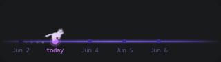

# cat-timeline

A lightweight **desktop widget** for Linux that turns your day into a glowing
timeline: one dot per day, a Cairo-drawn cat running in place on **today**, and
little dashes above each dot for the tasks due that day. It sits on your desktop
(below your windows, like a conky/eww widget) and you can **drag it anywhere**.
Hover a dot to highlight it; click it to manage that day's tasks.

The timeline, glowing line, dots, task dashes and the **portals** at each end are
all drawn with **Cairo** into a single transparent surface. On Wayland it anchors
itself to the desktop with **gtk-layer-shell**. The running cat uses the iconic
**RunCat** runner (5 sprite frames), embedded in the binary and tinted to match
your theme — see [Credits](#credits).



---

## Features

- A transparent, compact **260 × 90** **desktop widget**. On Wayland it's a
  **gtk-layer-shell** surface on the *bottom* layer — it lives on your desktop,
  below normal windows (like other desktop widgets), yet still takes clicks.
  (Without gtk-layer-shell it falls back to a borderless always-on-top window.)
- **Drag it anywhere** to reposition; the spot is remembered across restarts.
- A glowing horizontal timeline with a **portal** at each end — days dissolve into
  the portal as the strip scrolls and new days emerge from the other side.
- Five day dots — 1 past, today, 3 future — with today's dot under the cat.
- The RunCat runner (5 sprite frames), tinted and animated on today's dot.
- Per-day task dashes above each dot (max 8, then a `+N` overflow badge), colour
  coded by state (pending / today / past / done).
- Hover a dot to highlight it; no popup, so nothing flickers.
- **Click a dot** to open a styled task panel — a small card with the date, a
  completion bar, and a scrollable list to add, check off and delete that day's
  tasks. Press `Esc` or the `×` to close.
- **Double-click** empty space to open a matching **settings window**: a month
  calendar (days with tasks are marked; add/toggle/delete a day's tasks) and an
  **Appearance** tab with colour pickers for the timeline, cat, tasks, dots and
  **portals**. Changes apply live and are saved. `Esc` / `×` closes it.
- Right-click for a **Quit** menu.
- The timeline scrolls with the clock: each day's dot sits on the cat at
  midnight and drifts left as the day elapses, so tomorrow's dot reaches the cat
  as today ends. Set `CAT_TIMELINE_DEMO=<seconds>` to compress a "day" into that
  many seconds and watch it scroll.
- Saved under `~/.local/share/cat-timeline/`: tasks in `tasks.json`, colours in
  `settings.json`, drag position in `position`. All written on every change.

---

## Dependencies

| Package | Purpose            |
|---------|--------------------|
| `gtk3`  | windowing / widgets |
| `cairo` | 2D drawing (pulled in by gtk3) |
| `gtk-layer-shell` | anchors the widget to the desktop on Wayland (**recommended**) |
| `meson` | build system       |
| `ninja` | build backend      |
| a C99 compiler (`gcc` or `clang`) | |

`gtk-layer-shell` is **optional but recommended**: with it, the widget becomes a
proper desktop surface (below your windows, draggable, positioned by the
compositor). Without it the build still works but falls back to a borderless
always-on-top window. `cJSON` is bundled in `assets/` — no extra package needed.

### Install on Arch

```sh
sudo pacman -S gtk3 gtk-layer-shell meson ninja gcc
```

### Debian / Ubuntu

```sh
sudo apt install libgtk-3-dev libgtk-layer-shell-dev meson ninja-build gcc
```

### Fedora

```sh
sudo dnf install gtk3-devel gtk-layer-shell-devel meson ninja-build gcc
```

---

## Install

**1. Install the dependencies** for your distro (see the commands above).

**2. Clone, build and run:**

```sh
git clone https://github.com/Andrew-Velox/cat-timeline.git
cd cat-timeline
meson setup build
ninja -C build
./build/cat-timeline
```

**3. (Optional) install it system-wide** so you can launch it as `cat-timeline`
from anywhere (`/usr/local/bin/cat-timeline` by default):

```sh
sudo ninja -C build install
```

---

## Autostart (Wayland / Hyprland)

Built with `gtk-layer-shell`, the widget anchors itself to the desktop, so **no
window rules are needed** — just start it at login. On **end-4 /
illogical-impulse** put this in `~/.config/hypr/custom/execs.conf`; otherwise use
your main `~/.config/hypr/hyprland.conf`:

```ini
exec-once = cat-timeline
```

`exec-once` only runs at login, so to start it right now without re-logging in:

```sh
hyprctl dispatch exec cat-timeline
```

The widget appears on the desktop (bottom-right by default) and reopens wherever
you last dragged it. It lives on the *bottom* layer, so it sits **behind** your
windows — you'll see it on an empty workspace or wherever the desktop shows.

> **Built without gtk-layer-shell?** The app falls back to a borderless,
> always-on-top window. Then you may want Hyprland rules to pin it and strip the
> compositor's border/rounding/shadow, e.g.:
>
> ```ini
> windowrule = match:title ^(cat-timeline)$, float on
> windowrule = match:title ^(cat-timeline)$, pin on
> windowrule = match:title ^(cat-timeline)$, border_size 0
> windowrule = match:title ^(cat-timeline)$, rounding 0
> windowrule = match:title ^(cat-timeline)$, no_shadow on
> windowrule = match:title ^(cat-timeline)$, no_blur on
> ```

> For a true see-through widget your compositor must do alpha blending (Hyprland
> does out of the box; on X11 make sure a compositor like `picom` is running).

---

## Data format

`~/.local/share/cat-timeline/tasks.json` (created on first save):

```json
{
  "2026-06-03": [
    { "id": "6a201b8e001", "text": "Fix bug",   "done": false },
    { "id": "6a201b8e002", "text": "Write docs", "done": true }
  ]
}
```

The whole file is loaded into memory on startup and rewritten on every change.
The palette lives next to it in `settings.json`, and the widget's dragged
position in `position` (two numbers: right/bottom margin in pixels).

---

## Project layout

```
cat-timeline/
├── meson.build
├── README.md
├── src/
│   ├── main.c        entry point, GTK init
│   ├── app.h         shared state + geometry constants
│   ├── window.c/h    layer-shell desktop surface (or fallback window), draw
│   │                 callback, drag + saved position
│   ├── timeline.c/h  line, end portals, dots, date labels, task dashes
│   ├── cat.c/h       Cairo cat animation
│   ├── tasks.c/h     JSON load/save, task model, date helpers
│   ├── style.c/h     shared CSS theme for the task panel + settings window
│   ├── settings.c/h  colour palette load/save (settings.json)
│   ├── settings_window.c/h  double-click calendar + appearance window
│   └── input.c/h     mouse events, drag, context menu, task panel
└── assets/
    ├── cJSON.h
    ├── cJSON.c          bundled single-file JSON library (MIT)
    ├── runcat_frames.h  RunCat sprite frames embedded as byte arrays
    └── runcat/          original PNG frames + LICENSE (Apache-2.0)
```

The sprite frames are decoded once at startup with gdk-pixbuf and painted via
their alpha channel as a mask, so the cat is recoloured to your chosen "Cat"
colour at render time.

---

## Performance notes

Only the widget's small rectangle is repainted, and only when something changes:

1. the 100ms cat-animation timer fires (advances the cat + portals),
2. the pointer enters or leaves a dot's hover zone,
3. the widget is being dragged,
4. task data changes.

A single drawing area, a single timer, no extra threads. The layer surface spans
the screen but its input region is limited to the widget (expanded only while
dragging), so clicks elsewhere pass through to the desktop.

---

## Credits

The running cat sprites are from **RunCat** by **Takuto Nakamura (Kyome22)**:
<https://github.com/Kyome22/RunCat365> — `resources/runners/cat/`. They are
licensed under the **Apache License 2.0**; the full license text is kept at
[`assets/runcat/LICENSE`](assets/runcat/LICENSE). The frames are embedded in
this project unmodified (re-tinted at render time only).

## License

- `assets/cJSON.{c,h}` — © Dave Gamble and cJSON contributors (MIT).
- `assets/runcat/*.png` — © 2025 Takuto Nakamura (Apache-2.0, see above).
- The rest of this project is provided as-is.
